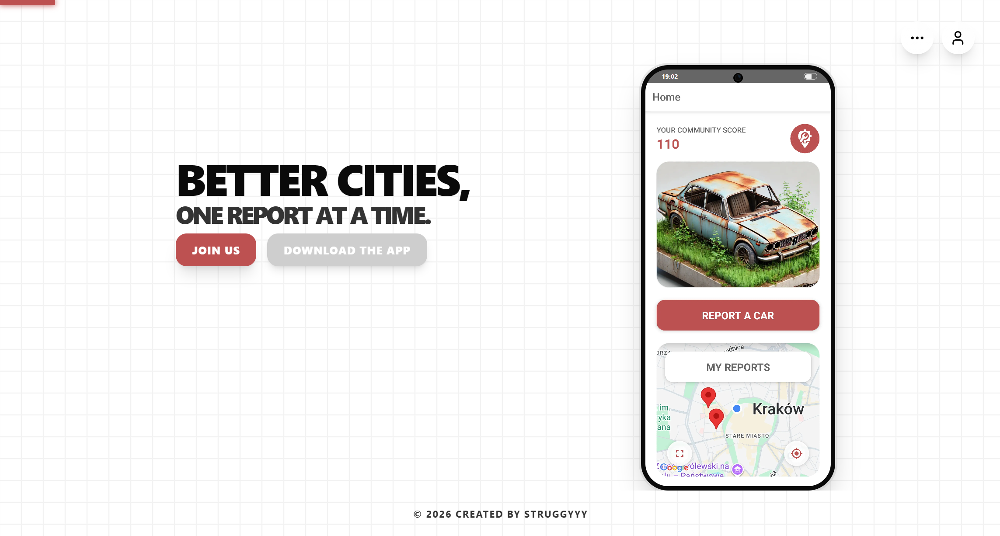

# RustyWeb 🌐

**RustyWeb** is the official web portal and administrative dashboard for the **Rusty** ecosystem. It serves as both a high-conversion landing page for the mobile app and a powerful tool for administrators to manage and verify reported vehicles.



[**🚀 View Live Demo**](https://rusty-web-two.vercel.app/)

---

## ✨ Features

- **Admin Dashboard**: Specific interface for admins to review, accept, or reject vehicle reports.
- **Interactive Demo**: A fully interactive, pixel-perfect simulation of the mobile app directly on the landing page.
- **Secure Authentication**: Robust user management using **Firebase Auth**.
- **Bilingual Support**: Seamlessly switch between **English** and **Polish**.
- **Dark Mode**: Fully responsive dark and light themes that adapt to your system preference.
- **High Performance**: Built with **Next.js** for blazing fast load times and SEO optimization.

---

## 🚀 Getting Started

### Prerequisites
- **[Node.js](https://nodejs.org/)** (LTS version recommended)
- **Git**
- **npm** (comes with Node.js)

### Installation & Configuration
1. Clone the repository:
   ```bash
   git clone https://github.com/struggyyy/RustyWeb.git
   cd RustyWeb
   ```
2. Install dependencies:
   ```bash
   npm install
   ```
3. Create a `.env` file in the root directory for your environment variables:
   ```env
   # Firebase Configuration
   NEXT_PUBLIC_FIREBASE_API_KEY=your_api_key
   NEXT_PUBLIC_FIREBASE_AUTH_DOMAIN=your_project.firebaseapp.com
   NEXT_PUBLIC_FIREBASE_PROJECT_ID=your_project_id
   NEXT_PUBLIC_FIREBASE_STORAGE_BUCKET=your_bucket.appspot.com
   NEXT_PUBLIC_FIREBASE_MESSAGING_SENDER_ID=your_sender_id
   NEXT_PUBLIC_FIREBASE_APP_ID=your_app_id
   NEXT_PUBLIC_FIREBASE_MEASUREMENT_ID=your_measurement_id

   # Google Maps
   NEXT_PUBLIC_GOOGLE_MAPS_API_KEY=your_google_maps_key
   ```
   *(Note: Collaborators must request specific API keys from the project lead)*

### Running the App
Start the development server:
```bash
npm run dev
```
Open [http://localhost:3000](http://localhost:3000) with your browser to see the result.

---

## 🛠️ Tech Stack

- **Framework**: [Next.js](https://nextjs.org/) (v15+)
- **Language**: TypeScript
- **Styling**: [Tailwind CSS](https://tailwindcss.com/) (v4)
- **Icons**: Lucide React
- **Backend / Auth**: Firebase (v11)
- **Internationalization**: `i18next` & `react-i18next`
- **Testing**: Vitest & React Testing Library
- **Deployment**: Vercel

---

## 🧪 Testing & Quality

We use **Vitest** for unit and integration testing.

- **Run Tests**: `npm test`

---

## 📄 License

This project is proprietary and confidential. All rights reserved. See the [LICENSE.md](LICENSE.md) file for details.

---

**Copyright © 2026 @struggyyy. All Rights Reserved.**
